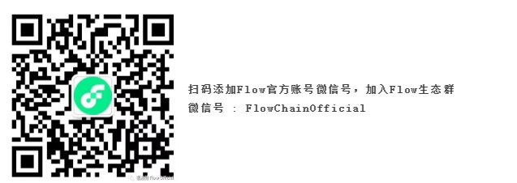

# Flow 中文指南

### _欢迎参与贡献_

### 如何为“Flow 中文指南” 贡献并提供中文资源？

#### 1. fork “[docs-flow](https://github.com/FlowFans/docs-flow)” Github 仓库： 



 

####  2. 根据目录 提交自己的中文文档 ，并发 PR 请求

内容建议使用 `Markdown`  格式提交文件，内容经过 review 后将会尽快更新到[ docs.flowfans.org](https://docs.flowfans.org)

  

#### 3. 欢迎提交 贡献的中文内容如下：

* Flow 社区优秀 文章翻译
* Flow 中文技术文章
* Flow 生态其他相关项目介绍
* ..... 

**4.  加入Flow 社区**

#### 我们欢迎越来越多的小伙伴加入Flow星球，为星球增添色彩！















## **扫码添加Flow官方账号微信号，加入Flow生态群**

 ****

**微信号 : FlowChainOfficial**

当前内容目录： 









