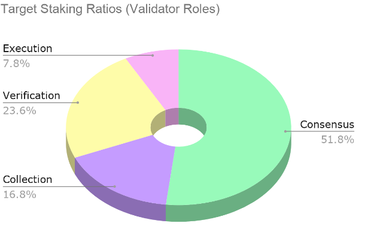

# Flow 区块链架构

福洛是开放世界的区块链。 它由以太坊上最成功的一些加密应用背后的团队开发，是一个从头开始重新设计，对用户和开发 者友好、模块化、面向未来的区块链。 福洛的全新四节点架构实现了速度和费用的极大优化，扩容性由硬件性能决定，兼顾去中心化， 无须分片或依赖“2层”解决方案。

FLOW代币（“FLOW”）是福洛网络的原生代币，也是一个全新、包容性、无国界的数字经济的基 石。如果区块链是数字基础设施，那么FLOW代币就是给它提供能量的燃料。 FLOW有一些重要的特征，使它成为新一代游戏、消费类应用以及相关数字资产的理想货币。 

1\) 多元的使用场景 

2\) 广泛的分配 

3\) 低通胀 以下对其做更详细的解释。

### 多元的使用场景

FLOW是搭建于福洛区块链上的应用、游戏和智能合约的原生代币，因此也是开发者和用户可以 用于链上交易的代币。开发者可以轻松地将FLOW整合进自己的应用中，用作P2P付款、支付服务 费用或是为消费者的价值创造提供奖励 。用户也可以持有FLOW、转账或彼此之间交易。 代币的持有者可以通过质押FLOW，并运行验证人节点维护网络安全性 —也可以将代币委托给他人 ，由其代表运行验证人节点—从而获得奖励。节点为网络提供安全性保证、计算和存储服务，并 以此获得质押奖励及部分交易费。

链上的每一个行动都需要支付小额的FLOW—从创建新用户账号、到存储资产和智能合约等。随着 网络成熟，FLOW的持币人将逐渐解锁更多使用场景：

* 支付计算和验证服务（即交易费）
* 交易媒介
* 数据存储的保证金
* 二级代币的抵押资产
* 参与治理

  最完美的支付体验应当是对交易各方而言都是无缝的：买家可以选择任意货币支付；卖家可以选

  择任何货币定价和收款。福洛上的应用即可以实现这一点。由于福洛的高吞吐量、低交易费以及

  完整的ACID保证，开发人员可以选择去中心化的交易所（DEX）作为代币之间的清算机构。福洛

  有能力使用频繁批次拍卖来克服对去中心化交易所的提前交易攻击。

  FLOW在福洛网络上的普及性使得其天然的成为交易不频繁的交易对之间的“过桥资产”。随着福洛

  上二级代币的数量增多，潜在交易对的数量将会呈指数级增长，这意味着某些交易对之间需要诸

  如FLOW这样的媒介。

  很重要的一点在于，要在福洛上创建和使用其它的代币，就需要FLOW-用于支付存储费和/或作

  为抵押资产

### 广泛的分配 

原生代币的分配对于网络去中心化和长期的成功至关重要。链上的开发者需要原生代币部署智能 合约、支付交易费（“gas”）并负担存储费和账户保证金，代币供应的中心化限制了其获得原生代 币的便利性。 要想充分实现福洛链的潜力，一个安全且可持续的分配策略是至关重要的：我们必须保证FLOW 掌握在正确的人手中。除了技术实力和加密经济安全性外，我们也意识到，福洛链要想长期成功 ，一个健康且可持续的分配策略也是不可或缺的。 FLOW将推动各类新社区接触区块链和去中心化应用，开发真实的使用场景并从中获益，而非参 与投机。良好的用户体验设计将使得持有和使用FLOW成为无缝体验。最终，FLOW将聚集网络中 的各类社区，一道创造和分享价值。 福洛开创了多个大规模参与项目：

* Cloudburst Partners：FLOW持有者选出的个人或组织，运行一个或多个福洛节点，并将

  节点奖励分给开发者、设计者、社区组织者以及为福洛创造内容的企业家。

* Floodplain Validators: 有兴趣早期支持福洛，并助力其实现足够数量的内容和去中心化资

  源，以支持一个可持续网络的开发者、基础设施合作伙伴和其它生态系统参与者。

* Decentralized Reputation and Incentive Protocol \(DRIP\): 旨在实现可访问性，并帮助基

  于福洛的应用找到活跃的用户群。DRIP将FLOW代币分配给最终用户，以便其质押、委托

  代理人并积极参与福洛的经济之中。

  凭借福洛强大的技术、杰出的社区以及良好的激励设计，今天链上的早期参与者将成为未来开放

  世界的奠基者。

### 低通胀

诸如福洛此类区块链有赖于去中心化社区运行计算机硬件（“验证人节点”）来支持链上行为，并 维护链上资产的价值。其它区块链严重依赖增发代币（“通胀”）来吸引验证人节点。

然而，不管是在哪个经济体中，货币通胀都是有代价的：新发行的代币会稀释所有代币持有人的 权益，从而形成对持有人事实上的持币税和使用税。这就是为什么福洛对于我们的代币规定了总 量上限。事实上，随着网络费的增加，FLOW的通胀率会下降。 在当前稳定状态下，福洛保证节点的固定奖励，并且只有当交易费达不到该固定奖励时，才会增 发新的代币来弥补这一缺口。随着交易费和奖励之间的缺口逐渐缩小，增发率接近0%。如果交易 费超过该固定奖励，超出部分将保存在一个第三方托管账户中，并用于无限对冲未来的通胀。 在上线后第一年，货币通胀率将较高，以激励更高的质押率，与此同时，福洛经济的抵押、支付 和其它部分功能将逐渐发展成熟。

## 技术细节

### 交易处理和计算 

作为去中心化的网络，福洛按照行为对用户－或他们使用的App－收费，与AWS Lambda对其计 算资源的收费模式类似。 福洛网络上共有两类费用： 

● 处理费覆盖提交并打包交易； 

● 计算费则只在需要进行除更新余额之外的其它计算操作时才支付。 

网络初期的交易费将极低，最低可达0.001 FLOW。

### 质押奖励与通胀 

作为一个权益证明的区块链，福洛要求验证人节点锁定一定数量的FLOW代币作为保证金，以作 为负责网络运行的基础设施的一部分参与，这一过程被称为质押。质押避免了低成本的“女巫”攻击（也即一个人操纵多个节点，以形成对网络的不当影响），并作为绑定的保证金，一旦节点试 图发起网络攻击，罚没保证金。 

福洛每一年都为验证人节点提供FLOW总发行量的固定比例作为奖励，这部分奖励由新增发行 （通胀）和交易费（与增发合并称“总奖励”）两部分构成。我们将谨慎设定总奖励率，以保证其 尽可能小，同时维护网络的安全性（当前计划设为每年总发行量的3.75%）。

过高的通胀率会导 致一系列意外的后果，并减少代币对非质押用户的吸引力。 为确保质押人获得足够的激励，选择特定时间最需要的节点角色，将通过一系列乘数（称为“奖励 系数”）对各类节点的总收入进行调整。具体数值由协议自动调整：如果某类节点角色持续质押不 足，则协议将提高该类节点奖励，直到实际质押余额向目标比率收敛。以下是节点池的初始比率 （按照安全性最优计算得出）：

目标质押比率（节点角色）： 

执行 7.8% 

验证 23.6% 

共识 51.8% 

收集 16.8%

要获得奖励，福洛节点须遵循协议中定义的流程（基于自身角色），一旦行为偏离协议，可能导 致奖励减少或处罚。这一奖惩机制旨在保证协议的安全性，并持续优化网络性能。 某些严重破坏网络安全性的违规行为可能导致节点的全部或部分质押代币被没收并销毁。这一过 程被称为“罚没（slashing）”。本文件列出会导致“罚没”的严重违反协议行为（称为“罚没条 件”）。执行这些条件对于协议的加密经济安全性至关重要。在福洛上，只有对安全性和活性的严 重威胁才构成“罚没条件”，换言之，性能相关的事件不会导致罚没惩罚。

### 支付存储费：最低FLOW额

 福洛上的存储可与单个用户账号而非智能合约关联：这一功能将极大的提高福洛上应用程序的用 户体验。在没有此功能的区块链上，一旦智能合约的开发者不支付”状态租金“，所有搭建其上的 用户资产都会化为乌有。在福洛链上，不经用户同意，用户资产永远不会消失，或被抹去。 福洛要求每个账户里锁定最低数额的保证金（要求FLOW代币），作为该账户链上存储的费用： 这一保证金永不花费，也不进入流通，从而增加给存储节点的质押奖励。

福洛账户刚刚创建时要求的最低余额不到1FLOW，足以满足初期大部分行为的需求。为了方便用 户上手，开发者如果已有一个确定的商业模式（如：收取用户订阅费或销售游戏内商品），可以 代替用户存入这一最低余额。没有FLOW的开发者可以直接向代币持有者借，或是发行自己的二 级代币，并用其交换FLOW： 形成一种去中心化、无需信任的众筹。 账户里的FLOW余额高意味着用户或开发者可用的存储空间更多。我们预计，假以时日，随着节 点实现规模经济，存储的费用将下降，锁仓的每单位FLOW所能获得的存储空间将大大增加。 “福洛生态基金（Flow Ecosystem Reserve）”的一大工作，就是与广泛的社区组织联盟一道，在 网络上线后的几年内，实现向1000多万个账户分发代币。这保证了任何想要使用或基于福洛开发 的人，都可以入场 。 尽管同质化代币对存储的要求很低，但是非同质化代币（NFT）所要求的链上存储—以及FLOW的 最低余额要求—却非常可观，因为每一个NFT都是独一无二的。因此高级用户可以自行维护自己的 余额，以获取更大的存储空间。 就长期而言，用户代理（钱包）和Dapp也可以帮助用户删除资源、在链下对资源备份、或使用存 储型区块链解决方案（如Filecoin, arweave或是直接搭建于福洛上的类似解决方案）来实现链上 存储空间的“再循环”。

### 服务协议 

作为针对去中心化应用的一个新的商业模式，服务协议（也称作中间件协议）是为应用提供服务 的智能合约。Chris Burniske对其进行如下解释： 其他人将它们称作“服务层协议”，因为它们专注为接口层提供特定服务，如金融、社会和技 术等。金融服务包括交易所、借贷和风险管理等；社会服务提供投票、仲裁或法律合同管理 等；技术服务包括缓存、存储、位置以及更完整的、一个统一的操作系统，以便打包进接口 层。 服务协议是开源的，因此在各类区块链上部署其代码非常简单。真正难以复制的部分在于它们所 协调的状态：也即生态系统各类参与者之间的网络效应，以及服务的最终用户。

在其它区块链上，这个状态会被分成片，或是通过跨片桥来实现片与片之间的通信，这增加了复 杂性、费用、时延以及分片上应用出错的可能性。分片削弱了服务协议的网络效应—也即其价值 所在。 在福洛上，服务协议和用户账号、应用程序以及其它智能合约一样，始终存在于同一个共享的、 且符合ACID原则的状态中。这有助于其它开发者基于这些服务协议开发，加速了网络效应。

### 融合:二级代币的一个新模式 

如今的区块链世界，大多数服务协议使用的二级代币不会反哺底层的生态系统。因此，它们与为 它们提供安全性保障的底层区块链之间的激励并不一致。在福洛上，我们激励关键服务协议，通 过一个“绑定曲线机制”，将代币与FLOW绑定，这一过程称为“融合”，二级代币称为“融合代币”， 而被绑定的代币（即FLOW）称为“储备代币”。 绑定曲线机制最初是为了给代币，包括交易十分清淡的代币，提供强大的价格发现和流动性而设 计的，比如融合的代币INF由某个智能合约控制，允许任何人按照当前汇率，在提供足够数量 FLOW的情况下，发行新的INF代币，与此同时，对下一位交易者的汇率就会略有提高（因为需求 增加，而导致的价格上涨）。相反，同样的智能合约允许INF的持有者以即时汇率赎回FLOW（减 去一点差价），从而导致汇率下降。（这两篇文章对绑定曲线做了非常好的介绍。） 融合代币对这一想法进一步推进，并注意到，如果储备代币有一个安全性和治理功能，那么可以 用锁在合约里的储备代币实现服务协议支持底层区块链的安全性，同时直接并主动参与协议的治 理。

因此，融合代币对持币人而言，有以下四个好处：

* 保证流动性：绑定曲线意味着服务协议代币的持有者始终知道存在一个具有流动性的市场

  ，允许它们将代币换成FLOW。这样的流动性保证有利于服务协议快速获得用户的关注和

  兴趣。

* 降低波动：当代币的需求发生变化时，绑定曲线允许其价格与供给及时调整，这就减少了

  固定供给代币始终无法摆脱的牛熊周期的可能性和规模。

有利于安全性：使用FLOW作为担保资产，服务协议在依赖福洛网络安全性的同时，又反 过来支持网络安全性。作为担保资产锁仓的FLOW越多，意味着可用于质押的FLOW越少 ，这允许市场的力量对资源分配进行动态调节。

* 参与协议治理：FLOW作为底层担保资产发行的二级代币可通过投票参与福洛的协议治

  理。这一点很重要，因为毫无疑问，服务协议的所有者和运行者都是一个智能合约区块链

  中最重要的利益相关者。

  福洛或许使用一部分可观的生态系统基金来助推利于整个网络的服务协议的早期发展，包括至少

  一个去中心化的稳定币。这部分基金将永远不会进入流通：相反它们将用于支持和补贴服务协议

  ，推动其激发网络上的活动。

### 福洛上的稳定币 

稳定币是指价值相对某一法币—或一篮子法币—稳定的加密货币。 稳定币在游戏和消费类应用中的价值在于：主流的消费者（以及为其提供服务的企业）或许更倾 向用当地的货币交易，尤其是应用发展的初期阶段。同样，需要提前做规划的企业也看重可预测 性，以及用相同的货币计量成本和收入的能力。 在福洛上实现稳定币很容易—目前已经有几个开发中的稳定币。概括而言，有两大类稳定币；都 需要用FLOW来支付其需要的网络资源； 

● 基于法币的稳定币是同质化代币，其供应量取决于可供兑换的法币数量，这些法币往往存 放于一个经审计的银行帐户里。与所有的福洛用户一样，此类稳定币的持有者也需要在其 帐户中锁定最低余额的FLOW-也可以由应用为他们提供。 

● 算法类稳定币使用FLOW作为抵押资产，发行二级代币，该类稳定币的供给由算法调整， 以保持其币值相对某一法币的稳定。福洛已经预留了相当数量的FLOW代币，来支持至少 两个算法类稳定币，它们的安全性由FLOW代币保证。

假以时日，随着用户逐渐重视FLOW在福洛网络上的价值，这一原生代币将因其流动性和直接用 途而成为用户偏好的交换媒介。

### 治理

 一经发布，福洛协议将实施非正式的链下治理：开发团队独立运行，并负责为去中心化的社区开 发。与比特币或以太坊类似，任何人都可以在Flow GitHub repo里提交改进建议，这些建议由福 洛的首席架构师Dieter Shirley 和Alex Hentschel领导的核心开发团队评估。协议升级以提议方式 传达给各类节点，是否采纳由节点自行决定。 从2020年下半年开始，在社区的推动下，链上投票将作为一种信号灯机制开启：投票不具有约束 力，但是整个社区可见，这将为开发团队的行动提供指引。 此外，上线后的第一年，生态系统发展的工作将由多个去中心化自治组织（DAO）共同推进，要 参与这些DAO的投票，就需要FLOW或是“FLOW融合”代币。基于福洛的服务协议（如稳定币）将 是首批转为完全链上治理的协议之一。 未来，福洛社区将参与链上治理，定义网络升级并提供反馈。最初，FLOW的利益攸关方将投票 选出一个代表理事会，负责日常事务。理事会的投票作为“默认选项”，持币人可以选择不作为消 极接受－或是主动推翻。 提案将发布在公共的论坛上，任何可以访问福洛的人都可以看到。实践中，我们预计大多数的决 策都会由理事会作出，无须持币人投票。然而，所做出的一切决策都将公开，所有的利益攸关者 都有机会组织其他持币人发起自下而上的行动，否决具体的决策，或是投票改选理事会成员。 通过这一治理过程，将做出以下三类决策： 

● 生态系统决策：与网络运行相关，且无法在协议定义中表达的事项：包括诸如选举理事 会成员，或是确定基金会给予拨款或奖金。 

● 协议参数：协议的某些方面（如每一类节点允许多少机器参与）将设为协议参数，无须 协议升级（因此无须新版本的节点软件）。这些参数可以通过治理过程修改。

● 协议升级：协议升级（“硬分叉”）理论上可以对协议的各方面进行修改：共识算法、底 层网络通讯架构、修改或添加新的执行环境。实践中，这类升级将极为罕见，并要求广 泛参与，以及全体FLOW持有者认可。

作为创始团队，我们希望在本文件中纪录我们对几大关键原则的承诺，我们将严格捍卫这些关键 原则，哪怕是在网络转为社区治理之后。我们谨鼓励未来的社区成员，在考量是否违背以下原则 时，展现出极大谨慎： 

● 维护不同节点类型之间的力量均衡 

● 保持通胀率尽可能低（目前最高不超过3.75%） 

● 确保FLOW作为二级代币的主要储备资产 

● 确保交易和存储费就长期（天和周）而言响应市场需求，而短期（分钟和小时）则高度 可预测。

### 结论：起源 

上线前，福洛网络及相关工具与组件、以及基于福洛开发的内容都是来自不同国家、不同企业的 100位开发者、设计师和产品人员共同努力的结果。 随着产品彻底开源、FLOW的发行以及主网彻底上线，新一代的企业家、开发者、设计师和创造 者可以参与福洛。 福洛的设计面向主流用户。网络上正在开发的一些应用服务数十亿的粉丝群体。这为社区提供机 会，开发新的产品和服务，实验新的商业和融资模式，以及社区驱动的治理和最终所有权。 福洛既是一个快速实验的沙盒，又是一个与时俱进的可靠、面向未来的基金会。 FLOW代币将助推全新的商业模式，并将数百万的早期用户带入与Dapp的首次接触中。最终， FLOW将集聚所有开发和使用福洛区块链的社区，一道创造并共享价值。 福洛的使命就是让世界变得更加开放、透明、欢乐。加入我们吧！ 以下是帮助创造者快速上手的一些关键资源： 

1. 福洛入门必读：了解福洛独特的架构，为什么我们不相信其它的扩容方案，以及为什么我 们的解决方案对用户和开发人员更友好。

2. 福洛Playground：学习Cadence这一首个面向资源的高级编程语言，并用我们绝妙的教程 学写你的第一个福洛智能合约。 

3. 交易之旅（即将上线）：遍历从账户创建到交易签名整个用户旅程，来了解福洛和现有的 区块链有什么区别—以及为什么福洛更好。 

4. 开发者工具：一旦准备好开发，你会发现福洛模拟器、SDK、命令行界面和相关工具非常 棒！

