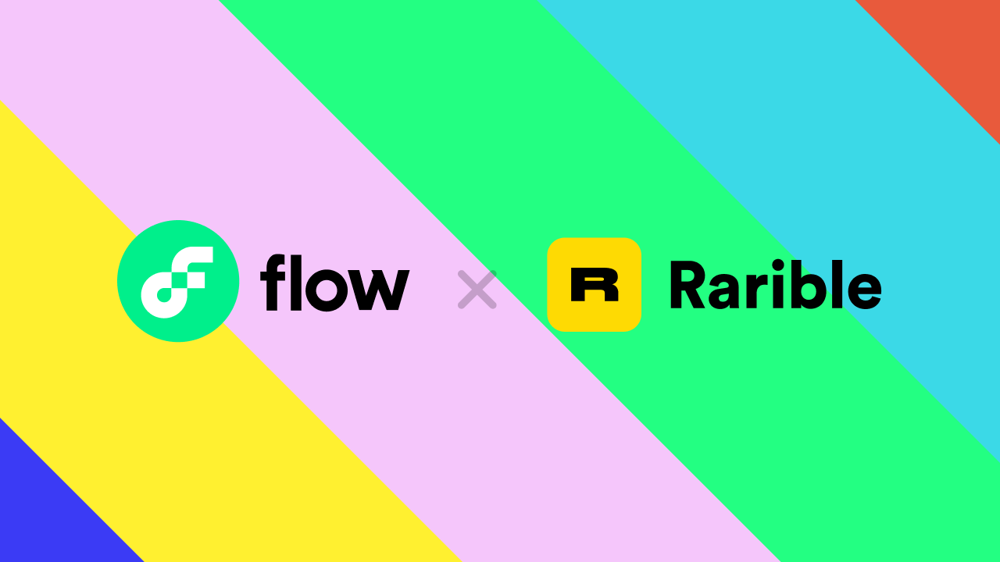

# 如何使用 Rarible 在 Flow上创建NFT ？

## 如何使用 Rarible 在 Flow上创建NFT ？

目前，Rarible 已经完全集成了 Flow——一个快速、去中心化和可持续的区块链——这意味着你现在可以在 [Rarible.com](ru-he-shi-yong-rarible-zai-flow-shang-chuang-jian-nft.md#ru-he-shi-yong-rarible-zai-flow-shang-chuang-jian-nft) 上创建、列出和交易基于 Flow 的 NFT，享受极低的 gas 费用和快速的用户体验。 Flow 是为最佳游戏和 NFT 体验量身定制的区块链，最初由 CryptoKitties 和 NBA Top Shot 背后的公司 Dapper Labs 创建。 Flow 上最昂贵的交易类型目前的成本**约为 0.0001 美元**，而Flow区块链的吞吐量旨在扩展到数百万活跃用户。 此外，由于 Flow 是为最终用户和开发人员创建的，我们还将其与 **Rarible 协议**集成，这意味着您现在可以利用完全开源的基础设施来构建具有 Flow 完善的开发人员人体工程学的 NFT 项目。

### 一、用户可通过 Rarible 平台快速创建 NFT&#x20;

1. 在Rarible平台上使用 Blocto 钱包登录

**Rarible 平台:**  [https://rarible.com/](https://rarible.com)

**Blocto 钱包：**[https://blocto.portto.io/zh/](https://blocto.portto.io/zh/)

如果您是 Blocto 的新手，只需使用您的电子邮件，只需点击几下即可创建一个钱包。

.png>)

&#x20;  2\. 如果您的钱包中没有 FLOW 代币，请存入一些以购买 NFT

Blocto 账户注册后会自动为你创建一个Flow钱包 （第三方托管模式），目前只有 Blocto 可用作 Flow 的登录选项——更多选项即将推出！ FLOW 现在可以在 Binance.com 和 Crypto.com 等网站上购买。

**Blocto 目前正在补贴交易 gas 费用，因此您不需要 FLOW 来进行诸如发布或铸造 NFT 之类的交易！**

&#x20;   3\. 点击“创建” 进行创建Mint NFT

.png>)

按照通常的流程 填写NFT的信息，并 Mint 出售您的 NFT 🏄‍

### &#x20;

.png>)

### 二、开发者用 Rarible Protocol 构建 Flow  NFT项目

Rarible Protocol 是一套开源、跨链社区治理的 NFT 协议，其目的在于简化 NFT 项目构建流程，帮助开发者快速构建产品上市。Rarible 协议被设计为一组构建块，可以创建任何级别和复杂性的完全定制的 NFT 体验。

.png>)

****:tada:**Rarible Protocol 访问：**[**https://rarible.org/**](https://rarible.org)** **

****

目前 Rarible 协议 已经支持了 Flow 测试网， 该协议具备的功能包括：&#x20;

*   **可定制的NFT 界面 **

    从像 Rarible.com 这样的大型项目，到创作者的小规模**项目**，该协议使 NFT 店面的开发和定制变得简单。

*   **NFT铸币应用**

    使用Rarible的共享订单簿缩短上市时间，允许协议应用到 Mint NFT，并让其他应用程序处理这些 NFT 的销售和分销。

* **NFT 发现和管理程序**

&#x20;      有各种应用程序可能希望使用该协议来浏览/发现和管理 NFT，包括钱包或 DAO 框架。

*   **功能货币化**

    使用 Rarible 协议，开发人员可以创建创新功能并在协议上集成应用程序，以通过费用拆分进行测试、验证和货币化。

**Rarible 团队构建了对 Flow 区块链的支**持：

Flow 的 Cadence 合约已经部署，详细信息可见：

[https://github.com/rarible/flow-contracts](https://github.com/rarible/flow-contracts)

Flow 的NFT索引器：&#x20;

[https://github.com/rarible/flow-protocol-api](https://github.com/rarible/flow-protocol-api)

Flow SDK：&#x20;

[https://github.com/rarible/flow-sdk](https://github.com/rarible/flow-sdk)

其中各个部分之间的关系如下：

 (1).png>)

协议基于区块链层（为每个支持的区块链编写的智能合约）。这些智能合约允许用户铸造和交换代币。

在合约之上，我们构建了索引器来索引区块链状态的一部分。这使我们可以查询有关 NFT 的数据。

然后，编写 SDK 以与智能合约进行交互。

所有这些组件都是为支持的每个区块链编写的，并用于[Union 服务](https://github.com/rarible/union-service)和[Union SDK](https://github.com/rarible/sdk)

应用程序需要集成[Union 服务](https://github.com/rarible/union-service)和[Union SDK](https://github.com/rarible/sdk)才能以相同的方式与所有区块链进行交互。

